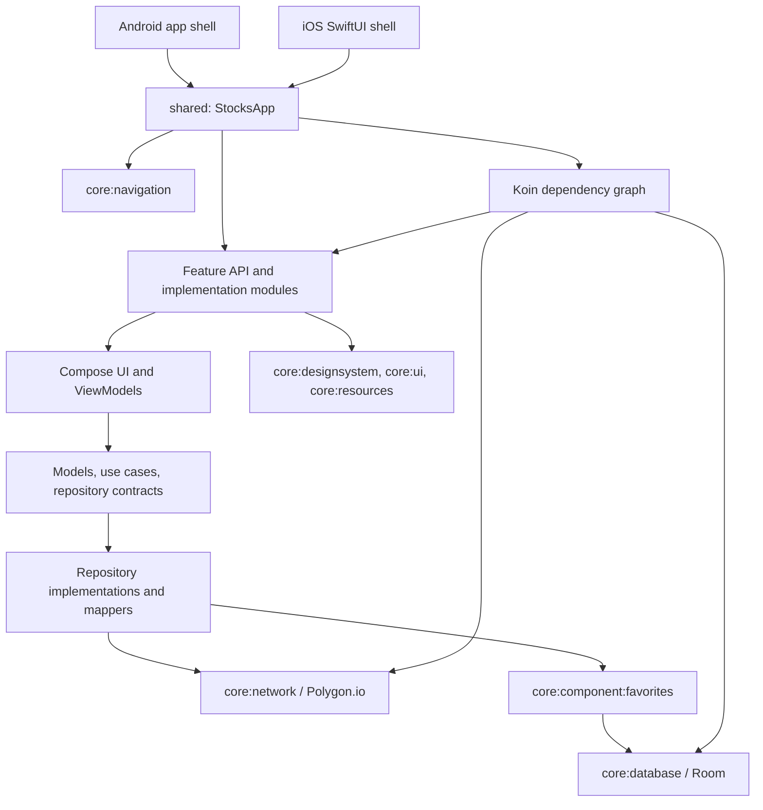

# StocksViewerCMP

StocksViewerCMP is a Compose Multiplatform application for browsing and searching stocks, viewing company details and price charts, and saving favorites for offline access. The Android and iOS apps share their UI, navigation, presentation, domain, data, networking, and persistence code.

Market data is provided by the [Polygon.io API](https://polygon.io/).

## Supported platforms

- Android (minimum SDK 28)
- iOS (minimum deployment target 16.0)

## Architecture overview

The project uses a modular, feature-oriented architecture. Most code lives in Kotlin Multiplatform `commonMain`; the Android and iOS source sets provide only platform-specific implementations such as HTTP engines, database builders, logging, and application entry points.



State flows from repositories and use cases into lifecycle-aware ViewModels, which expose immutable UI state to Compose screens. User actions travel back through the ViewModels to navigation, remote repositories, or the favorites repository. Network failures are converted from API errors to domain errors before reaching the UI.

Navigation uses serializable keys declared in each feature's `api` module. Feature screens, ViewModels, repositories, and dependency-injection definitions remain hidden in the corresponding `impl` module. This keeps cross-feature dependencies small and explicit.

### Modules

| Module | Responsibility |
| --- | --- |
| `:app` | Android application entry point, Android Koin startup, and logging setup. |
| `:iosApp` | SwiftUI host that initializes Koin and presents the shared Compose view controller. |
| `:shared` | Shared application root, theme, top-level tabs, navigation host, and complete Koin module list. |
| `:feature:list:api` | Public navigation contract for the stock list. |
| `:feature:list:impl` | Stock browsing, search, pagination, UI state, ViewModel, repository, and mappers. |
| `:feature:details:api` | Public navigation contract for stock details. |
| `:feature:details:impl` | Company overview, historical chart data, chart UI, favorites actions, and related domain/data logic. |
| `:feature:favorites:api` | Public navigation contract for the favorites list. |
| `:feature:favorites:impl` | Favorites screen, UI mapping, state, and ViewModel. |
| `:core:component:favorites` | Reusable favorites domain model, repository contract, and Room-backed implementation. |
| `:core:network` | Ktor client configuration, Polygon.io service, DTOs, API error handling, and platform HTTP engines. |
| `:core:database` | Multiplatform Room database, DAO, entities, schema, and platform database builders. |
| `:core:navigation` | Navigation state, navigator abstraction, back-stack behavior, and Navigation 3 integration. |
| `:core:designsystem` | App theme, typography, colors, icons, and reusable design-system components. |
| `:core:ui` | Shared UI helpers and reusable presentation components. |
| `:core:resources` | Multiplatform strings, string provider, and user-facing error mapping. |
| `:core:common` | Shared constants, domain errors, and common contracts. |
| `:core:testing` | Shared coroutine and Flow testing utilities. |
| `:build-logic` | Convention plugins that keep Android, Kotlin Multiplatform, Compose, Detekt, and secret generation configuration consistent. |

## Libraries

Versions are intentionally omitted; the source of truth is [`gradle/libs.versions.toml`](gradle/libs.versions.toml).

### Application and UI

| Library | Purpose |
| --- | --- |
| Kotlin Multiplatform | Shares application code across Android and iOS. |
| Compose Multiplatform | Implements the shared declarative UI. |
| Compose Runtime, UI, Foundation, and Material 3 | Provides state, UI primitives, layouts, interaction, and Material components. |
| AndroidX Compose BOM | Aligns Android Compose artifacts to a compatible dependency set. |
| Compose Multiplatform Resources | Generates and loads shared string resources. |
| Material Icons Extended | Supplies icons used by navigation and screens. |
| AndroidX Activity Compose | Hosts the Compose application in the Android activity. |
| AndroidX Lifecycle Runtime Compose | Collects ViewModel state with lifecycle awareness. |
| AndroidX Lifecycle ViewModel Compose | Provides multiplatform ViewModels to Compose screens. |
| AndroidX Navigation 3 and ViewModel Navigation 3 | Implements typed navigation, back stacks, entry decoration, and entry-scoped ViewModels. |
| Koin Core, Android, Compose ViewModel, and Navigation 3 | Builds the shared dependency graph and injects services, repositories, ViewModels, and navigation entries. |
| Coil Compose with the Ktor network integration | Loads company logos and other remote images in shared Compose UI. |
| Vico | Renders stock price charts. |
| Kotlinx Immutable Collections | Exposes stable immutable collections in Compose UI state. |
| Kotlinx DateTime | Calculates date ranges for chart queries. |

### Data and networking

| Library | Purpose |
| --- | --- |
| Ktor Client Core | Provides the shared HTTP client and request APIs. |
| Ktor Content Negotiation and Kotlinx JSON serialization | Converts Polygon.io JSON responses to Kotlin models. |
| Ktor Logging | Logs HTTP traffic in debug builds. |
| Ktor OkHttp engine | Executes HTTP requests on Android. |
| Ktor Darwin engine | Executes HTTP requests on iOS. |
| Kotlinx Serialization | Defines serializable API models and navigation keys. |
| Kotlinx Coroutines | Powers asynchronous work, Flows, and ViewModel state updates. |
| Arrow Core | Represents successful and failed operations with `Either`. |
| Room | Stores and observes favorite stocks on both platforms. |
| AndroidX SQLite Bundled | Supplies a consistent SQLite implementation for the Room database. |
| Timber | Provides Android debug logging. |

### Testing and build quality

| Library or tool | Purpose |
| --- | --- |
| Kotlin Test | Supplies common multiplatform test APIs and assertions. |
| Kotlinx Coroutines Test | Controls dispatchers and virtual time in coroutine tests. |
| Turbine | Tests Flow emissions. |
| Kotest Property | Provides property-based test data and checks. |
| Mokkery | Creates multiplatform mocks for repository, use-case, and ViewModel tests. |
| KSP | Runs Room's multiplatform code generation. |
| Detekt with formatting and library rules | Performs Kotlin static analysis and formatting checks. |
| Kover | Generates Kotlin code-coverage reports. |
| Compose UI Tooling and Preview | Supports Android Studio previews and UI inspection. |

## Running the app

### Prerequisites

- Android Studio with Android SDK 36 installed
- JDK 17
- A free or paid [Polygon.io API key](https://polygon.io/dashboard/signup)
- For iOS: macOS with Xcode and an iOS 16 or newer simulator/device

Create `secrets.defaults.properties` in the repository root and add your Polygon.io key:

```properties
API_KEY="your_polygon_api_key"
```

The file is ignored by Git. The build generates a shared `BuildConfig` value from it, so the same key is used by Android and iOS.

### Android

Open the repository in Android Studio, let Gradle sync, select the `app` run configuration and an Android device or emulator, then click **Run**.

Alternatively, with a device connected:

```bash
./gradlew :app:installDebug
```

### iOS

Open `iosApp/iosApp.xcodeproj` in Xcode, select the `iosApp` scheme and an iOS simulator, then click **Run**. The Xcode build phase invokes Gradle to build and embed the shared Kotlin framework automatically.

## Useful checks

```bash
# Run shared Android-host unit tests
./gradlew testAndroidHostTest

# Run static analysis
./gradlew detekt

# Build the Android debug APK
./gradlew :app:assembleDebug
```
